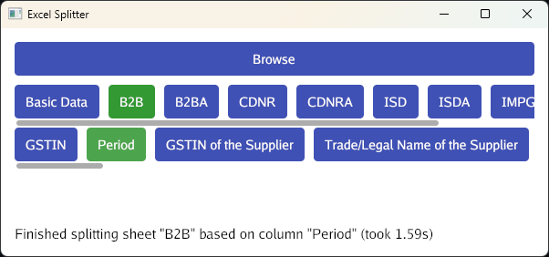

# Excel Splitter

Excel Splitter is a desktop application that can split Excel sheets based on a selected column's values.

## Download

Downloadable builds are available on the [releases page](https://github.com/shibijm/excel-splitter/releases).

## Usage

Select an Excel workbook, sheet name, and column header. A new directory named after the selected column header will be created alongside the source workbook. A new sheet will be created for every unique value in the selected column. These resulting sheets will be saved in new workbooks inside the aforementioned directory.
